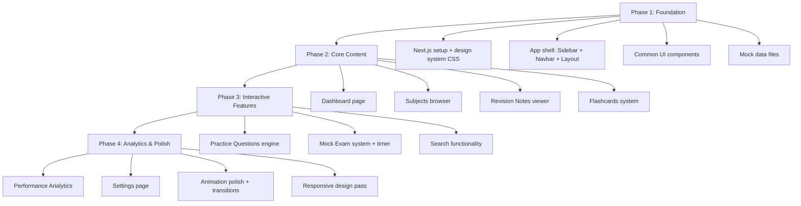

# AceStudy — Premium Study Platform Clone

A full-featured study platform combining the best of **SaveMyExams** (revision notes, topic questions, flashcards, past papers) and **Medify** (timed mock exams, performance analytics, question bank with difficulty filtering). Built as a stunning **dark-mode-first** Next.js web app with modern animations and premium UI/UX.

---

## Feature Breakdown: What We're Cloning

### From SaveMyExams
| Feature | Description |
|---|---|
| **Subject/Topic Browser** | Hierarchical navigation: Subject → Exam Board → Topic → Subtopic |
| **Revision Notes** | Rich, formatted study notes organized by topic with progress checkmarks |
| **Flashcards** | Flip-card system with "I know this" / "Still learning" sorting and progress |
| **Topic Questions** | Exam-style questions organized by topic with mark schemes and model answers |
| **Mock Exams** | Full exam simulations with automatic marking |
| **Past Papers** | Organized past paper archive by year and exam board |
| **Target Tests** | AI-generated quizzes targeting weak areas |
| **Smart Mark (AI)** | Instant AI-powered feedback on written answers |
| **Progress Dashboard** | Overview of completed notes, questions, and overall readiness |
| **Strengths & Weaknesses** | Analytics showing strong/weak syllabus areas |

### From Medify
| Feature | Description |
|---|---|
| **Massive Question Bank** | 20,000+ questions with difficulty levels and section categorization |
| **Timed Practice** | Configurable timer (timed/untimed modes) for each practice session |
| **Full Mock Exams** | 25 full mocks + 34 mini-mocks simulating real exam conditions |
| **Performance Analytics** | Detailed graphs, section breakdowns, score trends over time |
| **Timing Statistics** | Per-question timing analysis compared against average user times |
| **Video Tutorials** | Concept explanation videos embedded within topics |
| **Diagnostic Mocks** | Initial assessment to identify starting skill level |
| **Score Comparison** | Percentile ranking against other users |

---

## Tech Stack

| Layer | Technology | Rationale |
|---|---|---|
| **Framework** | Next.js 15 (App Router) | SSR, file-based routing, API routes |
| **Language** | TypeScript | Type safety across the app |
| **Styling** | Vanilla CSS (CSS Modules) | Full control, no framework bloat, per-component scoping |
| **Animations** | Framer Motion | Smooth page transitions, micro-interactions, card flips |
| **Icons** | Lucide React | Clean, consistent icon library |
| **Charts** | Recharts | Performance analytics graphs |
| **Font** | Inter (Google Fonts) | Modern, clean, highly readable |
| **State** | React Context + `useReducer` | Lightweight, no external state library needed |
| **Data** | JSON files (mock data) | No backend needed for the clone — all data is local |

---

## UI/UX Design System (Dark Mode)

### Color Palette
```
Background:       #0a0a0f (deep midnight)
Surface:          #13131a (card/panel backgrounds)
Surface Elevated: #1a1a24 (hover states, active panels)
Border:           #2a2a3a (subtle dividers)
Border Active:    #3a3a5a (focused elements)

Primary:          #7c5cff (vibrant purple — buttons, active states)
Primary Glow:     #7c5cff33 (soft glow/shadow behind primary elements)
Secondary:        #00d4aa (teal/mint — progress bars, success states)
Accent:           #ff6b9d (coral pink — alerts, important badges)
Warning:          #ffb547 (amber — warning states)

Text Primary:     #e8e8f0 (near-white, easy on eyes)
Text Secondary:   #8888a8 (muted labels, descriptions)
Text Muted:       #555570 (placeholders, disabled text)
```

### Typography
- **Font Family**: `'Inter', system-ui, -apple-system, sans-serif`
- **Heading Scale**: 2.5rem / 2rem / 1.5rem / 1.25rem / 1rem
- **Body**: 0.9375rem (15px) — optimal for extended reading
- **Letter Spacing**: −0.02em on headings, 0 on body
- **Line Height**: 1.6 for body, 1.2 for headings

### Animation Principles
- **Page Transitions**: Fade-in + slight upward slide (200ms ease-out)
- **Card Hover**: Gentle scale(1.02) + elevated shadow + border glow
- **Flashcard Flip**: 3D rotateY(180deg) with perspective(1000px), 500ms
- **Progress Bars**: Animated fill with gradient shimmer
- **Sidebar**: Slide-in with backdrop blur, 250ms
- **Skeleton Loaders**: Subtle shimmer effect while content loads
- **Micro-interactions**: Button press scale(0.97), smooth focus rings, ripple clicks
- **Charts**: Staggered bar/line animation on scroll-into-view

### Layout Structure
```
┌─────────────────────────────────────────────────┐
│  Top Navbar (logo, search, notifications, user) │
├──────────┬──────────────────────────────────────┤
│          │                                      │
│ Sidebar  │         Main Content Area            │
│ (collap- │  ┌──────────────────────────────┐    │
│  sible)  │  │  Breadcrumbs                 │    │
│          │  │  Page Header                 │    │
│ • Dash   │  │  ┌─────┐ ┌─────┐ ┌─────┐    │    │
│ • Subj   │  │  │Card │ │Card │ │Card │    │    │
│ • Notes  │  │  └─────┘ └─────┘ └─────┘    │    │
│ • Flash  │  │  ┌─────┐ ┌─────┐ ┌─────┐    │    │
│ • Quest  │  │  │Card │ │Card │ │Card │    │    │
│ • Mocks  │  │  └─────┘ └─────┘ └─────┘    │    │
│ • Stats  │  └──────────────────────────────┘    │
│ • Sets   │                                      │
└──────────┴──────────────────────────────────────┘
```

---

## Page-by-Page Implementation Plan

### 1. App Shell & Layout

#### [NEW] `src/app/layout.tsx`
Global root layout with Inter font, dark mode CSS variables, and metadata.

#### [NEW] `src/components/Layout/Sidebar.tsx`
- Collapsible sidebar with glassmorphism background (`backdrop-filter: blur(12px)`)
- Animated icon-only mode on collapse (width transitions from 260px → 72px)
- Navigation items: Dashboard, Subjects, Revision Notes, Flashcards, Questions, Mock Exams, Analytics, Settings
- Active state with glowing left border + purple highlight
- User avatar and quick-settings at bottom

#### [NEW] `src/components/Layout/Navbar.tsx`
- Fixed top bar with search input (expandable with ⌘K shortcut hint)
- Notification bell with badge count animation
- User dropdown menu
- Breadcrumb trail

#### [NEW] `src/components/Layout/Sidebar.module.css` + `Navbar.module.css`

---

### 2. Dashboard Page (`/dashboard`)

#### [NEW] `src/app/dashboard/page.tsx`
**Hero Section:**
- Greeting with time-of-day context ("Good evening, Matt 🌙")
- Study streak counter with flame animation
- "Continue where you left off" card linking to last-viewed content

**Stats Grid (4 cards):**
- Questions Answered (with animated counter)
- Study Hours This Week (with small sparkline)
- Average Score (circular progress ring)
- Streak Days (with fire emoji animation)

**Recent Activity Feed:**
- Timeline of last 5 actions (completed notes, answered questions, etc.)
- Each item has icon, description, timestamp, and link

**Recommended Next Steps:**
- AI-suggested topics based on weaknesses (from analytics)
- Cards with subject icon, topic name, reason ("You scored 45% on this topic")

**Quick Access Grid:**
- 6 subject cards in a responsive grid with gradient backgrounds and subject icons
- Hover animation: lift + glow

---

### 3. Subjects Browser (`/subjects`)

#### [NEW] `src/app/subjects/page.tsx`
- Grid of subject cards (Maths, Biology, Chemistry, Physics, English, etc.)
- Each card styled with unique gradient based on subject
- Animated entrance (staggered fade-in)
- Click leads to exam board selection

#### [NEW] `src/app/subjects/[subject]/page.tsx`
- Exam board selector (AQA, Edexcel, OCR, WJEC, IB, etc.)
- Topic tree view below — expandable/collapsible sections
- Each topic shows: completion %, number of notes, number of questions
- Progress bar per topic

---

### 4. Revision Notes (`/notes`)

#### [NEW] `src/app/notes/page.tsx`
- Browse notes by subject → topic hierarchy
- Filter/sort bar (by subject, completion, recently viewed)

#### [NEW] `src/app/notes/[topicId]/page.tsx`
- **Reading View** with:
  - Clean typography optimized for extended reading (max-width: 720px)
  - Table of contents sidebar (sticky on desktop)
  - Progress indicator at top ("2/8 sections complete")
  - Highlight/bookmark functionality
  - "Mark as complete" button with confetti animation
  - Embedded diagrams and formulas
  - "Related Flashcards" and "Practice Questions" links at the bottom
  - Smooth scroll between sections

---

### 5. Flashcards System (`/flashcards`)

#### [NEW] `src/app/flashcards/page.tsx`
- Grid of flashcard decks by topic
- Each deck card shows: topic name, card count, mastery percentage
- Search and filter by subject

#### [NEW] `src/app/flashcards/[deckId]/page.tsx`
- **Card Study Mode:**
  - Large centered flashcard with 3D flip animation
  - Front shows question/term, back shows answer/definition
  - Swipe or button controls: "Still Learning" (left/red) / "Got It" (right/green)
  - Progress bar at top (X of Y cards)
  - Keyboard shortcuts (Space to flip, ← / → to categorize)
  - End-of-deck summary with mastery stats
  - Option for "Shuffle" and "Only show unlearned"
  - Card count badges showing learned vs studying

---

### 6. Practice Questions (`/questions`)

#### [NEW] `src/app/questions/page.tsx`
- Question bank browser with filters:
  - Subject, Topic, Difficulty (Easy/Medium/Hard), Status (Unanswered/Correct/Incorrect)
  - Question type (Multiple Choice, Short Answer, Essay)
- Results shown as a list with difficulty badge, topic tag, and completion icon
- "Quick Practice" button that generates a random 10-question set

#### [NEW] `src/app/questions/[questionId]/page.tsx`
- **Question View:**
  - Question text with rich formatting
  - Multiple choice options with animated selection states
  - "Submit Answer" button with loading state
  - **After Submit:**
    - Correct: answer glows green, confetti burst, explanation appears
    - Incorrect: answer glows red, correct answer highlighted, detailed explanation slides in
  - Mark scheme reveal toggle
  - "Report Question" and "Bookmark" actions
  - Navigation to next/previous question
  - Optional timer (configurable, from Medify's timed mode)

---

### 7. Mock Exams (`/mocks`)

#### [NEW] `src/app/mocks/page.tsx`
- Grid of available mock exams
- Each mock card shows: exam name, duration, question count, difficulty, your best score
- "Start Exam" CTA button with pulsing animation
- Filter by subject, type (Full Mock / Mini Mock / Diagnostic)
- Completed mocks show score badge

#### [NEW] `src/app/mocks/[examId]/page.tsx`
- **Pre-Exam Screen:**
  - Exam details (time limit, question count, sections)
  - Rules and instructions
  - "Begin Exam" button

- **Exam Interface (fullscreen-like):**
  - Minimal UI — distraction-free
  - Large countdown timer at top (animated red when < 5 min)
  - Question number navigator (grid of numbered circles)
  - Flag/bookmark button per question
  - Progress bar
  - "End Exam" button with confirmation modal

- **Results Screen:**
  - Overall score with animated circular progress
  - Section-by-section breakdown
  - Time analysis per question (bar chart)
  - Comparison against average (Medify-style)
  - "Review Answers" button to see each question with explanations

---

### 8. Performance Analytics (`/analytics`)

#### [NEW] `src/app/analytics/page.tsx`
- **Score Trends:** Line chart of scores over time (animated on first view)
- **Subject Breakdown:** Radar chart showing performance across subjects
- **Strengths & Weaknesses:** Two-column layout
  - Green cards for strong topics (>80%)
  - Red/amber cards for weak topics (<50%) with "Practice Now" links
- **Time Analysis:** Average time per question by subject (bar chart)
- **Study Activity:** Heatmap calendar (GitHub-style) showing daily study activity
- **Mock Exam History:** Table with date, score, time taken, and trend indicator
- All charts animate in with staggered delays on scroll

---

### 9. Settings & Profile (`/settings`)

#### [NEW] `src/app/settings/page.tsx`
- Tabbed interface: Profile, Preferences, Appearance, Study Goals
- **Profile**: Avatar, name, email, exam info
- **Preferences**: Default timer settings, notification preferences, keyboard shortcuts
- **Appearance**: Theme selection (dark/darker/OLED black), accent color picker, font size
- **Study Goals**: Daily target (questions/minutes), streak management

---

### 10. Common Components

#### [NEW] `src/components/ui/Button.tsx`
Variants: primary (gradient), secondary (outline), ghost, danger. All with press animation.

#### [NEW] `src/components/ui/Card.tsx`
Glassmorphic card with hover glow effect. Variants: default, interactive, stat.

#### [NEW] `src/components/ui/ProgressBar.tsx`
Animated fill with gradient and optional shimmer. Shows percentage label.

#### [NEW] `src/components/ui/ProgressRing.tsx`
Circular SVG progress with animated stroke-dashoffset. Used for scores.

#### [NEW] `src/components/ui/Badge.tsx`
Small status labels: difficulty (easy/med/hard), status (complete/in-progress), exam board.

#### [NEW] `src/components/ui/Modal.tsx`
Centered overlay with backdrop blur, scale-in animation.

#### [NEW] `src/components/ui/SearchBar.tsx`
Expandable search with ⌘K shortcut, autocomplete dropdown, recent searches.

#### [NEW] `src/components/ui/Timer.tsx`
Countdown timer with circular animation. Red pulse when time is low.

#### [NEW] `src/components/ui/Skeleton.tsx`
Loading placeholder with shimmer animation.

#### [NEW] `src/components/ui/Heatmap.tsx`
GitHub-style activity heatmap grid showing study days.

#### [NEW] `src/components/ui/Breadcrumbs.tsx`
Navigation breadcrumb trail with animated separators.

---

### 11. Mock Data

#### [NEW] `src/data/subjects.json`
Subject list with icons, colors, and exam board mappings.

#### [NEW] `src/data/topics.json`
Topic trees per subject with subtopics and metadata.

#### [NEW] `src/data/questions.json`
Sample question bank (50–100 questions) with answers, explanations, and difficulty.

#### [NEW] `src/data/notes.json`
Sample revision notes content (rich text/markdown) for 5–10 topics.

#### [NEW] `src/data/flashcards.json`
Sample flashcard decks with front/back content.

#### [NEW] `src/data/mocks.json`
Mock exam definitions with question sets and time limits.

#### [NEW] `src/data/user-progress.json`
Simulated user progress data for dashboard and analytics.

---

## Implementation Order



### Phase 1: Foundation (Files: ~15)
1. Initialize Next.js 15 project with TypeScript
2. Create global CSS with complete design token system (colors, spacing, typography, animations)
3. Build `Sidebar`, `Navbar`, and root `Layout`
4. Build all reusable UI components (Button, Card, ProgressBar, etc.)
5. Create all mock data JSON files

### Phase 2: Core Content (Files: ~8)
6. Build Dashboard page with all sections
7. Build Subjects browser with topic tree
8. Build Revision Notes viewer with reading mode
9. Build Flashcards system with 3D flip cards

### Phase 3: Interactive Features (Files: ~6)
10. Build Practice Questions engine with answer checking
11. Build Mock Exam system with timer and fullscreen mode
12. Build search overlay with keyboard shortcut

### Phase 4: Analytics & Polish (Files: ~5)
13. Build Performance Analytics page with all charts
14. Build Settings page
15. Add Framer Motion page transitions throughout
16. Responsive design pass for mobile/tablet
17. Final animation and micro-interaction polish

---

## Verification Plan

### Automated Testing
Since this is a frontend-only app with mock data, we'll rely on:
- `npm run build` — Ensures zero TypeScript/build errors
- `npm run lint` — Ensures code quality

### Visual / Browser Testing
After each phase, we will run `npm run dev` and visually verify in the browser:

1. **Phase 1 Checks:**
   - Sidebar opens, collapses, and animates correctly
   - All UI components render with correct dark theme colors
   - Layout is responsive at mobile (375px), tablet (768px), and desktop (1440px)

2. **Phase 2 Checks:**
   - Dashboard displays all stat cards, activity feed, and subject cards
   - Subject browser drills down to topics with progress bars
   - Revision Notes render with table of contents and "mark complete" works
   - Flashcards flip with 3D animation and sorting works

3. **Phase 3 Checks:**
   - Practice questions accept answers, show correct/incorrect feedback
   - Mock exam timer counts down, questions navigate, end-of-exam screen shows results
   - Search overlay opens with ⌘K and filters results

4. **Phase 4 Checks:**
   - Analytics charts render and animate on scroll
   - Settings tabs switch correctly
   - Page transitions are smooth between all routes
   - No visual glitches at any breakpoint

### Manual Verification (User)
- After implementation, the dev server will be started with `npm run dev`
- **Please visit `http://localhost:3000` and navigate through all pages** to verify:
  1. The dark mode design looks premium and polished
  2. Animations feel smooth and intentional (not janky)
  3. Navigation between pages is intuitive
  4. The overall feel matches what you'd expect from a premium study app
